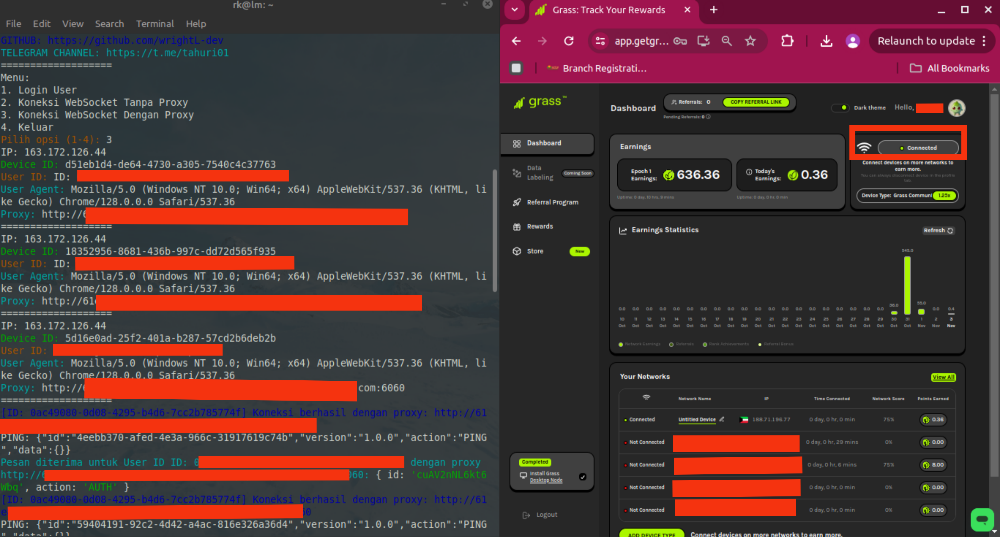

# BOT GRASS SEASON 2 - LITE ( EXTENSION ANDROID )



1. **Clone Repository**
   ```bash
   git clone https://github.com/wrightL-dev/GRASS/
   cd GRASS/

2. **Install Package**
   ```bash
   npm install fs readline uuid ws user-agents axios https-proxy-agent

3. **Login Dahulu Untuk Mendapatkan userid**

4. **Setelah Berhasil Login, Bisa Pilih Tanpa Proxy Ataupun Pakai Proxy**
   ```bash
   Note: Jika Ingin Pakai Proxy Tambahkan List Proxy Di File proxy.txt

## Dukungan

Jika Anda memiliki pertanyaan atau butuh bantuan lebih lanjut, silakan bergabung dengan saluran Telegram kami di [t.me/tahuri01](https://t.me/tahuri01).

## Lisensi

Proyek ini dilisensikan di bawah [MIT License](LICENSE).
